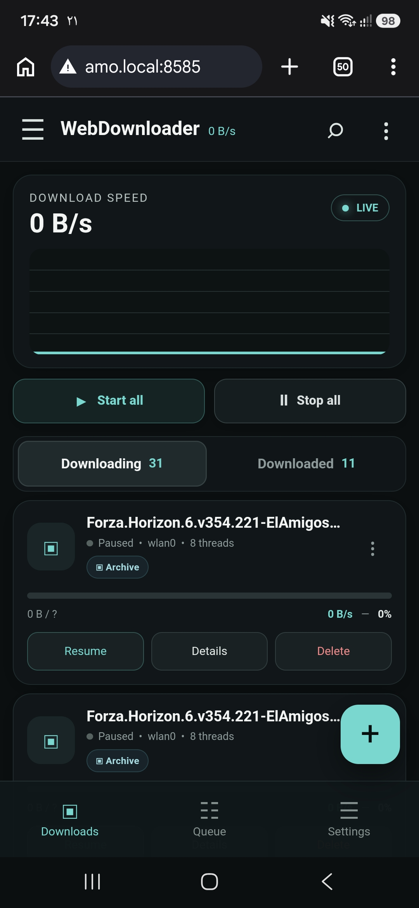
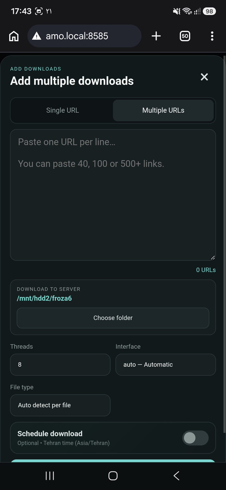
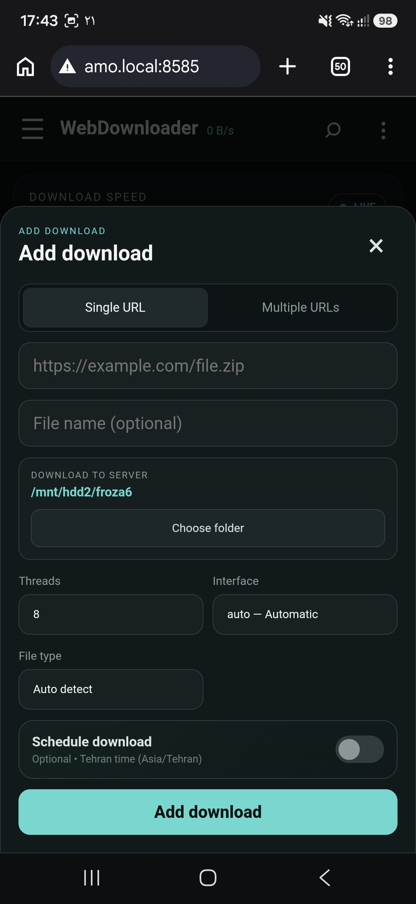

# WebDownloader Python

ADM-style lightweight web download manager for Raspberry Pi / Ubuntu / Termux.

<p align="center">
  
  
  
</p>


Run:
```bash
python3 -m venv .venv
. .venv/bin/activate
pip install -r requirements.txt
python3 main.py
```

Open `http://SERVER-IP:8585`.

Features:
- HTTP/HTTPS
- 1-16 HTTP Range workers
- `.part` resume
- Queue and concurrent downloads
- Bulk 40/100/500+ URLs
- Real `eth0` / `wlan0` / Auto binding
- Download location selector
- SQLite
- SSE realtime UI
- Pause/resume/retry/cancel
- Scheduler timestamp
- Mobile-first ADM-like UI

Download folder selection is constrained to the configured download root for safety. Set `download_dir` in Settings/config.json to e.g. `/mnt/hdd`.
